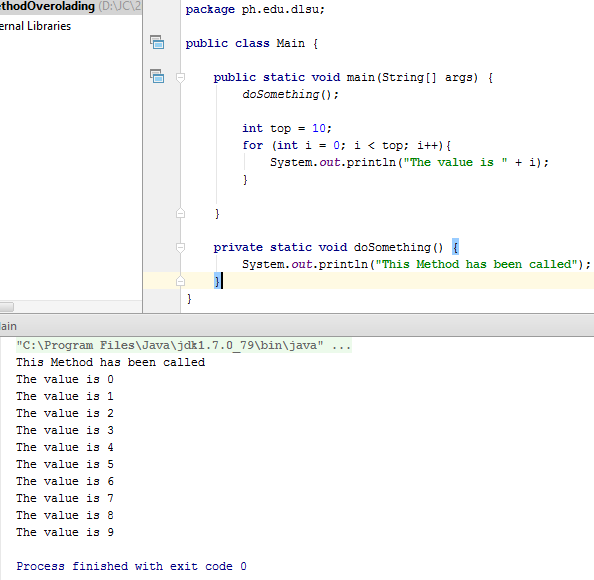

# Method

~~~
package ph.edu.dlsu;

public class Main {

    public static void main(String[] args) {
        doSomething();

        int top = 10;
        for (int i = 0; i < top; i++){
            System.out.println("The value is " + i);
        }

    }

    private static void doSomething() {
        System.out.println("This Method has been called");
    }
}

~~~
